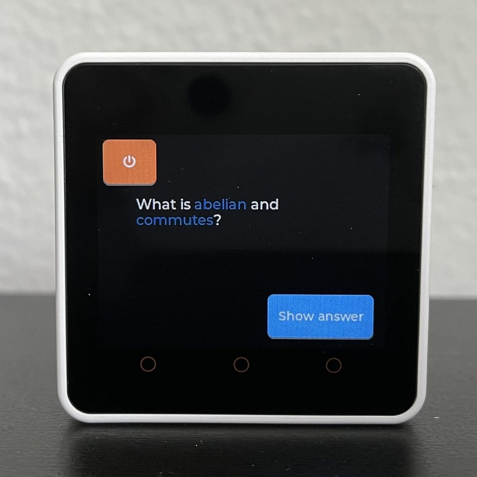
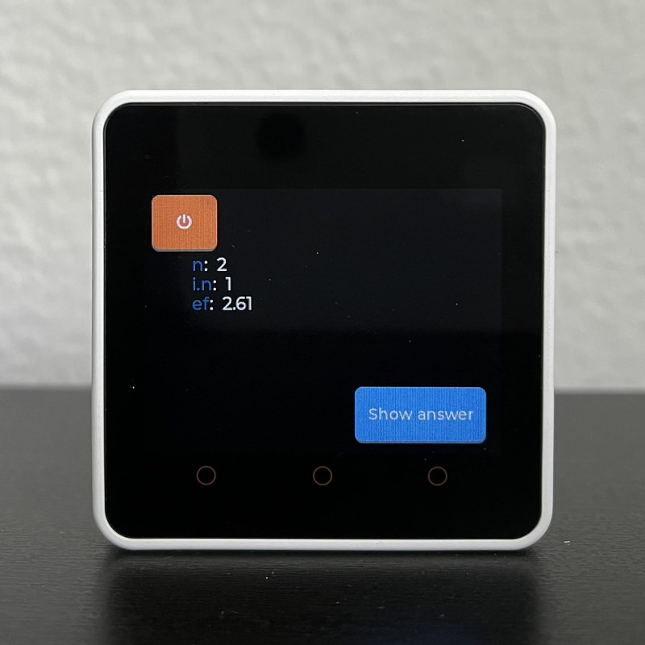
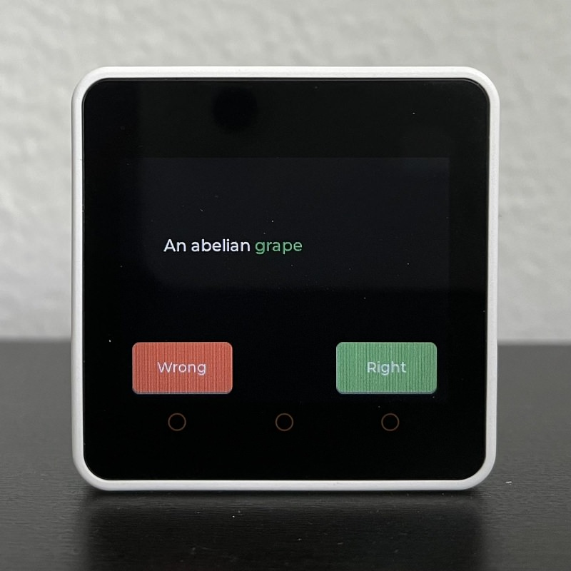

# StackMemo

A simple spaced repetition system for M5Stack Core2 devices and similar (anything with an ESP32, some storage and a screen would do) based on the SuperMemo2 algorithm.

## Functionality

Provided a python file `qa.py` with questions and answers as the one provided as an example, this will automatically generate (on the device, as you answer questions) a file `memos.json` with intervals and ease factors for each question, as you answer them.

> **Note**
> _Why a python file and not a json file?_ No particular good reason. I started with python and left it like that, it works.

The UI is simple:
- *Turn off button*: the button on top left; saves the current SuperMemo weights and powers off the device. It sleeps for a couple of seconds just in case something needs flushing. You never know.
- *Show answer*: only available in questions, of course. Shows the answer and enables right/wrong buttons. Also hides the power button because answers tend to be more verbose than questions.
- *Right/wrong*: only available in answers. Depending on what you pick, it will update the SuperMemo weights internally. Right uses `q=4.5` (almost perfect, perfect would be 5) and wrong uses `q=2` (quite wrong but not horribly wrong)
- *Question/answer area*: click it to show question information (it's actually just a large button):
    - `n`: number of times you have answered this question.
    - `ef`: ease factor for this question.
    - `i_n`: next "interval".
    - `c`: counter for number of questions answered in this session (until a restart)
    - `F`: number of questions marked as "to fix"

When in _Info mode_ (after tapping the question/answer area) the off button hides and a very large button with `To fix` appears. This lets you mark a question as needing editing. This is appended to a file `to_edit.json` and you can interact with it with some `gmake` commands.

Questions are shown starting from the smallest interval, but I don't use the Core2 RTC, I just keep showing questions ordered by `i_n`. Hacky: it won't give the full benefits of spaced repetition unless you "stop reviewing". But kind of gets the job done in showing "worse" questions first, which is what I wanted.

There is some minor reformatting of markdown tags in questions and answers, where `*`, `_` and `\`` are used to change text colors.

> **Note**
> Sometimes it hangs on start or on power off, seems to only happen while plugged to a computer. I'm not sure if there's a bug in the `to_edit` functionality, or I didn't test it well enough in the first iteration. But if it happens, a hardware (button, either reset or long-press to power off) or software (`gmake reset`) fixes it. It only seems to happen at start time, so no data loss.

## Installing

You need to get some form of micropython with `lvgl` on your board. In my case, I used [this one](https://github.com/lemariva/micropython-core2).

Next, easiest is to install `adafruit-micropython` (see [here](https://learn.adafruit.com/micropython-basics-load-files-and-run-code/install-ampy)) and execute `make upload device=DEVICEPATH`, device path will be something like `/dev/…`.

## Some images

| Question                            | Information                         | Answer                            |
| ----------------------------------- | ----------------------------------- | --------------------------------- |
|    |    |  |

## Algorithm

This thingy uses SuperMemo 2:

   Algorithm SM-2, © Copyright SuperMemo World, 1991.

   https://www.supermemo.com
   https://www.supermemo.eu
"
